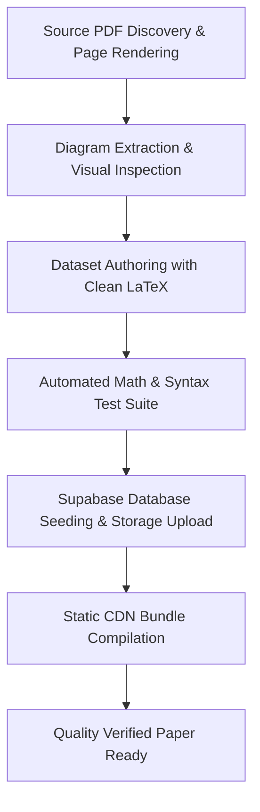

# Edutester Paper Testing & Verification Suite

This document defines the mandatory standard tests and quality assurance checks required for every JEE Main question paper processed, seeded, and integrated into the Edutester platform.

---

## 1. Core Principles & Strict Rules

> [!IMPORTANT]
> **Cloudflare Worker Deployment Rule**
> Never deploy directly to Cloudflare Worker (`wrangler deploy` or production edge deployment) automatically. Papers are seeded to Supabase and CDN bundles are generated in `public/papers/`. Production deployments must only be executed upon explicit user request.

---

## 2. Mandatory Test Pipeline for Every Paper

Every paper must undergo and pass the following 6 test phases:



---

### Test 1: Zero Dollar Sign ($) Audit
- **Why**: Edutester uses an intelligent inline math tokenizer (`src/lib/mathText.ts`) that automatically recognizes LaTeX math patterns without requiring `$ ... $` or `$$ ... $$` delimiters. If literal `$` signs remain in the question text, options, or solutions, they render as visible, ugly `$` characters on the student's exam interface.
- **Rule**: **0 dollar signs ($) allowed across all 75 questions, 240 options, and 75 solutions.**
- **Verification Method**: Regex search and automated test runner:
  ```ts
  if (text.includes('$')) {
    throw new Error(`[DOLLAR SIGN DETECTED]: ${text}`);
  }
  ```

---

### Test 2: KaTeX Syntax & Parser Validation
- **Why**: Malformed LaTeX syntax causes KaTeX render exceptions or broken equations in the exam UI.
- **Standard Checks**:
  1. **Zero `/frac` errors**: Replace all OCR/syntax errors like `/frac` with proper `\frac{numerator}{denominator}`.
  2. **Zero bare delimiters**: Never write bare `\left(` / `\right)` or `\left[` / `\right]` outside valid math scopes. Use standard parentheses `( ... )` or brackets `[ ... ]`.
  3. **Braced Subscripts & Superscripts**: Always use grouping braces for multi-character indices (e.g., `\text{K}_{\text{p}}`, `\text{K}_{\text{b}}`, `11^{\text{th}}`, `3\text{d}^5`).
  4. **Chemical/Physical Division**: Avoid unspaced slashes in chemical pairs (e.g. `\text{Pb}^{4+}/\text{Pb}^{2+}` which gets misparsed into fractions). Write as `\text{Pb}^{4+} / \text{Pb}^{2+}` or `\text{Pb}^{4+}\text{/}\text{Pb}^{2+}`.
  5. **Matrix Formatting**: Format matrices in Edutester array notation: `[[a, b], [c, d]]` (rendered as KaTeX smallmatrix).
- **Verification Method**: Every math token identified by `tokenizeMath` is rendered through `katex.renderToString(token, { throwOnError: true })`.

---

### Test 3: High-Resolution Diagram & Image Crop Verification
- **Why**: Blurry, misaligned, or cropped diagrams make physics circuits, optical lenses, and organic chemistry structures unreadable.
- **Standards**:
  1. **300 DPI Rendering**: Extract diagrams using PyMuPDF (`fitz.Rect`) at 300 DPI high-resolution directly from the authentic PDF.
  2. **Bounding Box Precision**: Bounding boxes must capture all relevant labels (e.g., vertex names, voltage arrows, capacitor labels, chemical reagents) while trimming out question numbers and extraneous text.
  3. **Visual Inspection**: Each cropped diagram must be visually inspected via `view_file` before finalizing.
  4. **Storage Sync**: Seed script (`scripts/seed-jee-paper.mjs`) automatically uploads all assets to Supabase Storage under `question-images/jee-2025/<paper-key>/`.

---

### Test 4: Section & Question Structure Integrity
- **Standard Structure (75 Questions)**:
  - **Physics (Q1–Q25)**:
    - Q1–Q20: Single Choice MCQ (4 options: A, B, C, D)
    - Q21–Q25: Numerical Value Questions (Integer or clean decimal answer)
  - **Chemistry (Q26–Q50)**:
    - Q26–Q45: Single Choice MCQ (4 options: A, B, C, D)
    - Q46–Q50: Numerical Value Questions
  - **Mathematics (Q51–Q75)**:
    - Q51–Q70: Single Choice MCQ (4 options: A, B, C, D)
    - Q71–Q75: Numerical Value Questions
- **Integrity Checks**:
  - Exactly 75 questions per paper.
  - Exactly 240 MCQ options (60 MCQs × 4 options each).
  - Exactly 75 official answer keys with step-by-step mathematical solutions.

---

### Test 5: Supabase Database Seeding Test
- **Tool**: `node scripts/seed-jee-paper.mjs <paper-key> --force`
- **Validation**:
  - Database schema compliance (`papers`, `questions`, `question_options`, `question_keys`).
  - Correct enum types (`type: 'mcq'` | `'numerical'`).
  - Image paths mapped to Supabase Storage public URLs.
  - Transaction integrity (old paper records cleaned and replaced cleanly).

---

### Test 6: Static CDN Bundle Compilation
- **Tool**: `node scripts/build-paper-json.mjs <paper-key>`
- **Validation**:
  - Compiles offline/cached JSON payload in `public/papers/<paper-key>.json`.
  - Verifies gzipped payload size (~10–12 KB).
  - Ensures seamless offline and fast loading for all test-takers.

---

## 3. Automated Test Script Template (`scratch/test_mathText_<paper>.mts`)

Every paper must have a dedicated test runner executed via `npx tsx`:

```ts
import fs from 'fs';
import { tokenizeMath } from '../src/lib/mathText';
import katex from 'katex';

const paperKey = '<paper-key>';
const raw = fs.readFileSync(`jee-out/${paperKey}/questions.json`, 'utf8');
const data = JSON.parse(raw);

let dollarCount = 0;
let slashFracCount = 0;
let totalSegments = 0;
let mathSegments = 0;
let katexErrors = 0;

function auditString(text: string, label: string) {
  if (!text) return;
  if (text.includes('$')) {
    dollarCount++;
    console.error(`[DOLLAR SIGN DETECTED in ${label}]: ${text.substring(0, 80)}`);
  }
  if (text.includes('/frac')) {
    slashFracCount++;
    console.error(`[/frac DETECTED in ${label}]: ${text.substring(0, 80)}`);
  }
  
  const segments = tokenizeMath(text);
  totalSegments += segments.length;
  for (const seg of segments) {
    if (seg.kind === 'math') {
      mathSegments++;
      try {
        katex.renderToString(seg.value, {
          throwOnError: true,
          displayMode: false,
          strict: false,
          trust: true
        });
      } catch (err: any) {
        console.error(`[KaTeX Error in ${label}]:\nMath Token: "${seg.value}"\nError: ${err.message}\nFull: "${text}"\n`);
        katexErrors++;
      }
    }
  }
}

for (const q of data.questions) {
  auditString(q.text, `Q${q.number} (${q.section}) text`);
  for (const opt of q.options || []) {
    auditString(opt.text, `Q${q.number} opt ${opt.label}`);
  }
  if (q.solution) {
    auditString(q.solution, `Q${q.number} solution`);
  }
}

console.log('==============================================');
console.log(`Auditing Paper: ${data.title} (${paperKey})`);
console.log(`Total Questions: ${data.questions.length}`);
console.log(`Dollar Signs ($): ${dollarCount}`);
console.log(`Slash Frac (/frac): ${slashFracCount}`);
console.log(`Total Segments: ${totalSegments}`);
console.log(`Math Tokens Validated with KaTeX: ${mathSegments}`);
console.log(`KaTeX Errors: ${katexErrors}`);
console.log('==============================================');

if (dollarCount > 0 || slashFracCount > 0 || katexErrors > 0) {
  process.exit(1);
}
```

---

## 4. Verification Checkpoint Log

| Paper Key | Date & Session | Questions | Dollar Signs | KaTeX Errors | Diagrams | Seeding Status | CDN Bundle |
| :--- | :--- | :--- | :--- | :--- | :--- | :--- | :--- |
| `22-jan-morning-2025` | 22 Jan S1 | 75 | 0 | 0 | Verified | Seeded (ID 191) | Built |
| `22-jan-evening-2025` | 22 Jan S2 | 75 | 0 | 0 | Verified | Seeded (ID 192) | Built |
| `23-jan-morning-2025` | 23 Jan S1 | 75 | 0 | 0 | Verified | Seeded (ID 193) | Built |
| `23-jan-evening-2025` | 23 Jan S2 | 75 | 0 | 0 | Verified | Seeded (ID 194) | Built |
| `24-jan-morning-2025` | 24 Jan S1 | 75 | 0 | 0 | Verified | Seeded (ID 195) | Built |
| `24-jan-evening-2025` | 24 Jan S2 | 75 | 0 | 0 | Verified | Seeded (ID 196) | Built |
| `28-jan-morning-2025` | 28 Jan S1 | 75 | 0 | 0 | Verified | Seeded (ID 197) | Built |
| `28-jan-evening-2025` | 28 Jan S2 | 75 | 0 | 0 | Verified | Seeded (ID 198) | Built |
| `29-jan-morning-2025` | 29 Jan S1 | 75 | 0 | 0 | Verified | Seeded (ID 199) | Built |
| `29-jan-evening-2025` | 29 Jan S2 | 75 | 0 | 0 | Verified | Seeded (ID 200) | Built |
| `2-apr-morning-2025` | 2 Apr S1 | *Pending* | - | - | - | - | - |
